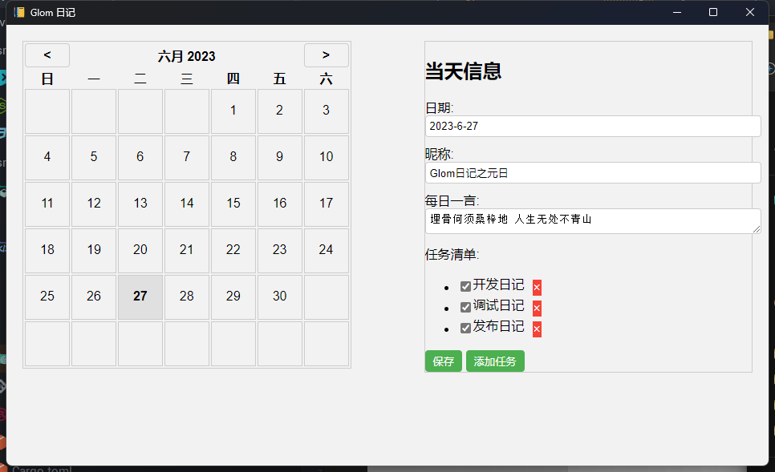

# Glom 的日记

## 起因

想找一个日记软件来用，无奈求之不得，就自己写一个吧。

基于 [**Rust**](https://www.rust-lang.org)+[**Tauri**](https://tauri.app/zh-cn/)开发，开发加调试时长大概 **2.5h** ，可以说是行云流水了。

本项目以 MIT 协议开源，请随意使用本项目代码！

## 使用

#### 测试

```
cargo tauri dev
```

#### 构建

```
cargo tauri build
```

界面截图:

<br/>

## 为什么不用 Electron ?

吾乃愚者，聞曰「Electron」，實是一奇幻之框架也。然吾亦覺其劣，宜遭詬病。其弊在何處？當是之時，其占據吾之寶貴內存，致使吾患苦無已。於是，吾不復循循善誘，乃尋他徑以求突破。

幸而，吾得遇一名「Tauri」，其乃新興之框架也。其與「Electron」相比，果然優勝。不獨其用資源稀少，且速度飛快。吾實為之心醉，因其能助我擺脫「Electron」所帶來之煩惱。

夫「Electron」，雖曰威名赫赫，不得不承認其確有卓越之處。然吾思慮良久，仍難以容忍其占據我脆弱之內存。其框架臃腫，貪婪無度，正如虎視耽耽之狼。吾終不忍與其為伍，決意遠離之。

「Tauri」，名不虛傳。其以輕便自居，無論內存或速度，皆遠勝「Electron」。吾心安之，踏上新征程。望彼時，吾能夜以繼日，全神貫註於創作之艱辛，不再被「Electron」所困擾。

吾以此文譴責「Electron」之無底線，亦歡慶「Tauri」之光輝。願後來者莫再遭受「Electron」之痛苦，而能追隨吾之腳步，走上「Tauri」之正道。遠離「Electron」，方能重見曙光，解脫束縛，獲得心靈之自由。

长话短说:

> Electron 是程序员偷懒，用户受罪的技术，我小小的内存可撑不住

<br/>

## 为什么用 Rust ?

**Rust **是一门赋予每个人构建可靠且高效软件能力的语言。它在高性能、可靠性、生产力方面表现尤为出色。Rust 速度惊人且内存利用率极高，由于没有运行时和垃圾回收，它能够胜任对性能要求特别高的服务，可以在嵌入式设备上运行，还能轻松和其他语言集成。Rust 丰富的类型系统和所有权模型保证了内存安全和线程安全，让您在编译期就能够消除各种各样的错误。Rust 也拥有出色的文档、友好的编译器和清晰的错误提示信息，还集成了一流的工具——包管理器和构建工具……

基于此，让 Rust 成为不二之选，开发人员可以很容易的使用 Rust 扩展 Tauri 默认的 Api 以实现定制化功能。

**对对对，我又来传教了。**

## 最后

快来学 \RUST/

<br/>

演示视频: _制作中_
